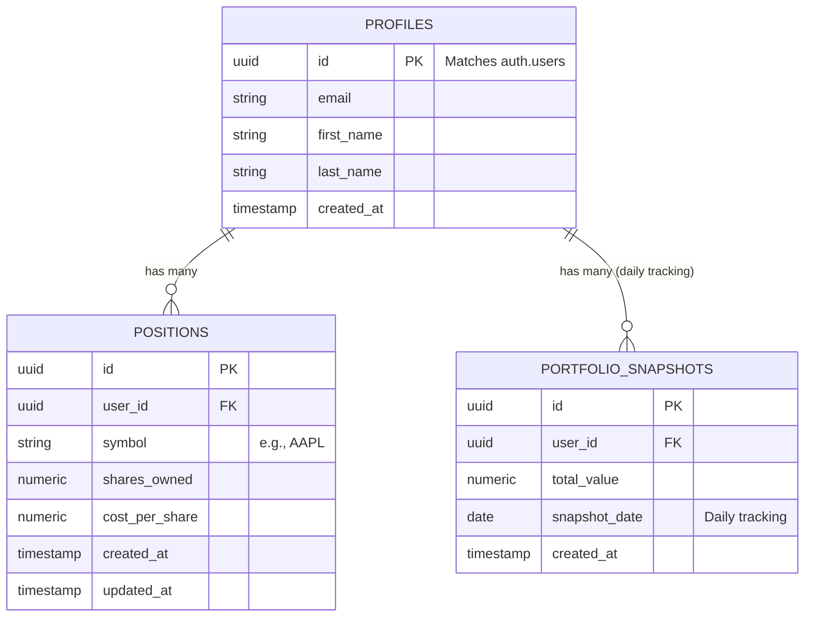

# QuantFolio 📈

**Advanced Wealth Analytics Platform**

QuantFolio is an institutional-grade, premium web application for managing, tracking, and analyzing personal stock portfolios. It combines a stunning dark-mode optimized design system with real-time analytics to give retail investors tools typically reserved for professionals.

[**Live Demo (Vercel)**](https://quantfolio-mauve.vercel.app/)

---

## 🌟 Key Features

*   **Premium Dashboard:** A responsive, 12-column grid architecture offering a "command center" view of your wealth.
*   **Real-time Analytics:** Tracks current prices, market values, and calculates real-time unrealized P&L across all positions.
*   **Smart Insights Engine:** Automatically detects sector concentration and overall portfolio risks.
*   **Risk Metrics:** Provides institutional-style metrics including Portfolio Volatility, Sharpe Ratio, and Maximum Drawdown.
*   **Interactive Projections:** Compound interest simulator to model future portfolio growth against expected market returns.
*   **Data Portability:** Seamlessly import and export portfolio positions via CSV.
*   **Responsive & Dynamic Theme:** Full light/dark mode support with fluid CSS variable-based styling, utilizing modern Tailwind v4.

---

## 🚀 Tech Stack

*   **Frontend Framework:** React 18 with TypeScript and Vite
*   **Styling Engine:** Tailwind CSS v4 (Using `@theme` directive & CSS Custom Properties)
*   **State Management:** Zustand (for Auth, Portfolio Data, and Market Data)
*   **Charting:** Recharts (Area charts, Pie charts with custom tooltips)
*   **Icons:** Lucide React
*   **Backend / Database:** Supabase (PostgreSQL with Row Level Security)
*   **Data Virtualization:** `@tanstack/react-virtual` (for handling massive stock lists smoothly)
*   **Hosting/Deployment:** Vercel

---

## 💾 Database Architecture (ER Diagram)

The backend runs on Supabase (PostgreSQL).



---

## 💻 Local Development Setup

To run this project locally on your machine:

**1. Clone the repository:**
```bash
git clone https://github.com/VivekJariwala50/QuantFolio.git
cd QuantFolio
```

**2. Install Dependencies:**
```bash
npm install
```

**3. Environment Configuration:**
Create a `.env` file in the root directory by copying `.env.example`:
```bash
cp .env.example .env
```
Fill in the following values in your `.env` file:
*   `VITE_SUPABASE_URL` - Your Supabase project URL
*   `VITE_SUPABASE_ANON_KEY` - Your Supabase public anon key
*   `VITE_FINNHUB_API_KEY` - Optional: Finnhub API key
*   `VITE_ALPHAVANTAGE_API_KEY` - Optional: Alpha Vantage API key

**4. Start the Development Server:**
```bash
npm run dev
```
Navigate to `http://localhost:5173` to see the app.

---

## 🔮 Future Roadmap

*   **Plaid Integration:** Auto-sync positions directly from brokerages (Fidelity, Robinhood, Schwab).
*   **Real Historical Data Pipelines:** Connect backend cron jobs to sync daily closing prices for accurate benchmark tracking.
*   **Options & Crypto:** Expand asset class support beyond US equities.
*   **Advanced Rebalancing:** One-click rebalancing suggestions to return to target sector weights.

---

## 📄 License

This project is open-source and available under the MIT License.
